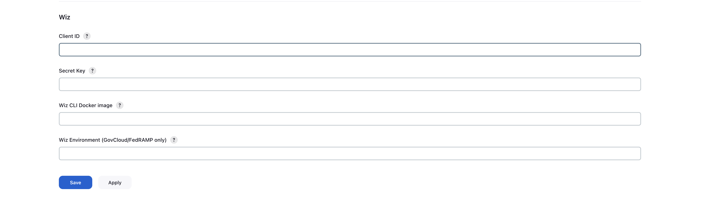
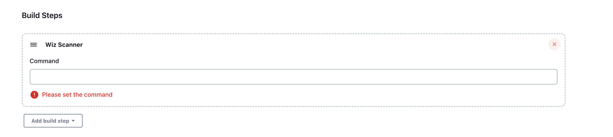

# Wiz Scanner Plugin 

## Introduction

This Jenkins plugin enables integrate Wiz CLI to detect sensitive data, secrets, misconfigurations, and vulnerabilities in container images, directories and IaC files.

## Getting started

### 1. Generate a Wiz service account key

To configure this plugin, you will need to generate service account, follow the documentation <a target="_blank" href="https://docs.wiz.io/wiz-docs/docs/set-up-wiz-cli?lng=en#generate-a-wiz-service-account-key">here</a>.

### 2. Copy Wiz CLI package URL

To configure this plugin, you will need to copy Wiz CLI URL according to the OS, follow the documentation <a target="_blank" href="https://docs.wiz.io/wiz-docs/docs/set-up-wiz-cli?lng=en#download-wiz-cli-to-a-linux-mac-or-windows-host">here</a>.

### 3. Configure the Wiz Jenkins plugin

#### Global configuration

Once the Wiz service account is created in your Wiz account and Wiz CLI URL copied, you will need to provide your Wiz Client ID, Secret Key and Wiz CLI Docker image in order to configure the Jenkins plugin. To configure, navigate to "Manage Jenkins" -> "System", then scroll to the "WIZ" section. Input the Wiz Client ID, Secret Key and Wiz CLI Docker image into the appropriate fields, then click Save.
##### Note! If you access Wiz from gov.wiz.io or app.wiz.us, you must configure the Wiz Environment field: gov OR fedramp
<blockquote>

📷 Show Preview

</blockquote>

#### Build Step Configuration

Once the global configuration is complete, you can add the Wiz Scanner build step to your pipelines.
Provide full custom command-line arguments.

<blockquote>

📷 Show Preview

</blockquote>

Once the Wiz Scanner build step is added, it will produce a Wiz Scanner result page.

## Contributing

To contribute to this repository, please review the [CONTRIBUTING](CONTRIBUTING.md) file.

Also, please refer to the Jenkins [contribution guidelines](https://github.com/jenkinsci/.github/blob/master/CONTRIBUTING.md)

## LICENSE

Licensed under MIT, see [LICENSE](LICENSE.md)

